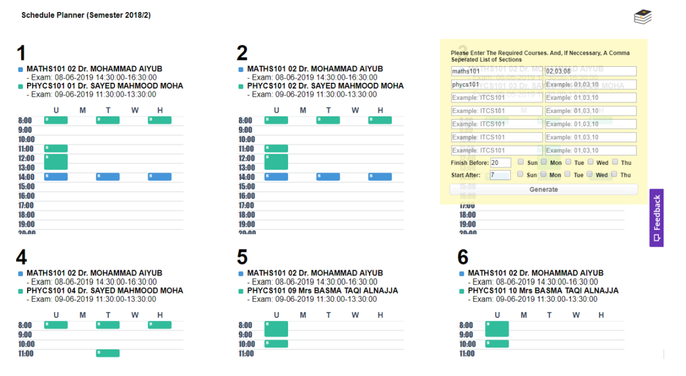

# Graphical-Schedule-Planner
This tool helps students better plan their course schedules by generating a visual representation of possible schedules with no time conflict, and according to your own specified search parameters.

Note: This source code is defaulted to return courses.json no matter the search parameters. You can update the code to retrieve data from a back-end as necessary.

